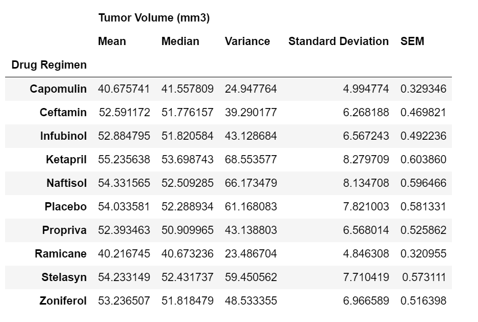
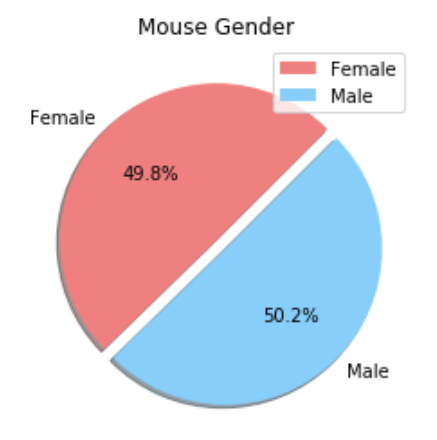
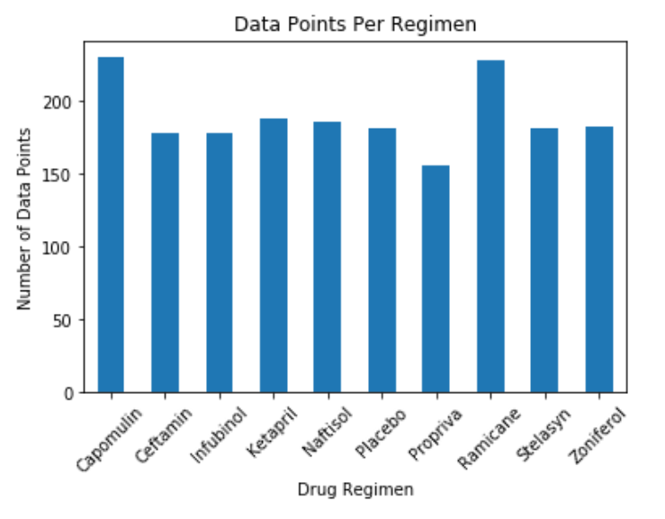
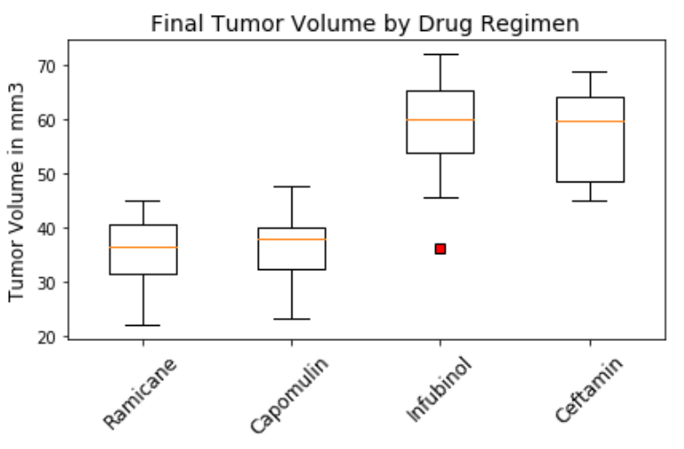
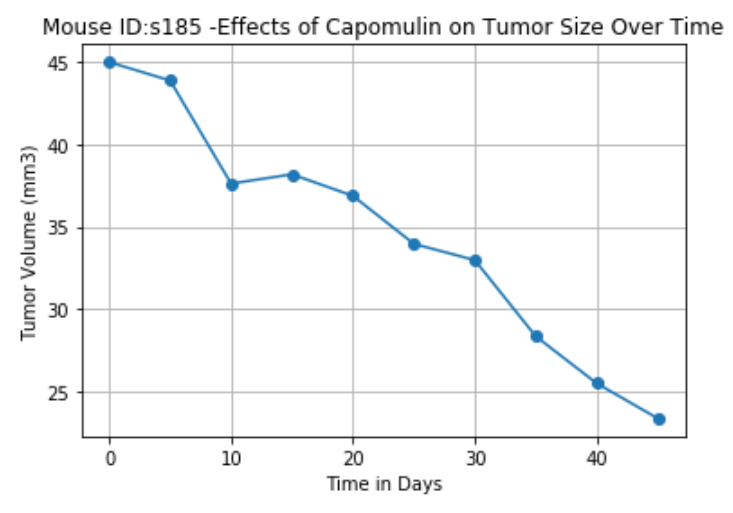
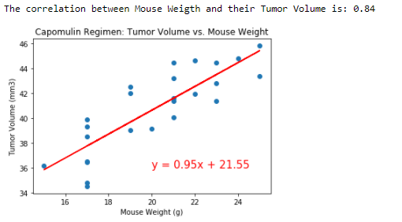

# Matplotlib: 

Pymaceuticals Inc: Analysis of Pharmaceuticals
As the senior data analyst for Pymaceuticals Inc., a pharmaceutical company based in San Diego that specializes in anti-cancer treatments, I have been tasked to review data from a study of potential treatments for a commonly occurring skin cancer-  squamous cell carcinoma (SCC). 

The study compared the effects of several drug regimens compared to the use of on in particular- Capomulin. Over the period of 45 days, 249 mice were treated with the different medications and their tumor growth was measured. 

Below you will see an analysis of the study as well as detailed results specifically from the drug treatment Capomulin. 

## Table of contents
* [Mouse Data](#mouse_data)
* [Mouse Gender](#mouse_gender)
* [Drug Regimens](#drug_regimens)
* [Capomulin Deep Dive](#capomilin_deep_dive)
* [Correlation](#correlation)
* [Conclusion](#conclusoin)
* [Jupyter Notebook](#jupyter_notebook)
* [Contact](#contact)

## Mouse Data

The study was conducted on 249 mice over the course of 45 days. The mice were evaluated every 5 days and their tumor growth was measured. 

To compile the data, I used a `pd.merge` function to combine to `csv` files into one combined `DataFrame`. I then used a `for loop` to locate any duplicate data logged per mouse ID. After locating duplicate data points, I used the `drop_duplicates` function to remove duplicate rows from the `DataFrame`. This left me with clean data for 249 mouse participants. 

Below is a table showing the `mean`, `median`, `variance`, `standard deviation` and standard error of the mean, or `SEM`, for the tumor volume (measured in mm3) for each drug regimens. 

To calculate this date, I used functions found in `sci.py.stats` and `numpy`. I was able to complete all calculations in one line of code by using an `.agg` function to apply the formulas to columns in a `DataFrame` . I went one step further to rename the column names for each equation to make the summary statsics easier to read. 

` grouped_regimen.agg({"Tumor Volume (mm3)": ['mean', 'median', 'var', 'std', 'sem']}).rename(columns={'mean' : 'Mean', 'median' : 'Median', 'var' : 'Variance', 'std' : 'Standard Deviation', 'sem' : "SEM"})`

## Mouse Gender

## Drug Regimens

## Capomulin Deep Dive
Describe how to install / setup your local environement / add link to demo version.

## Correlation
Show examples of usage:
`put-your-code-here`

## Conclusion
List of features ready and TODOs for future development

## Jupyter Notebook
Project is: _in progress_, _finished_, _no longer continue_ and why?

## Contact

Sara Simoes
